# Разработка мобильных компонент анализа безопасности информационно-аналитических систем

Поспелова Ульяна БИСО-03-20

## Практическая работа №1

Программа была успешно установлена. Был создан проект Lesson1. Далее был создан и запущен эмулятор.

### Запуск приложения

После запуска приложение отобразилось на экране эмулятора.

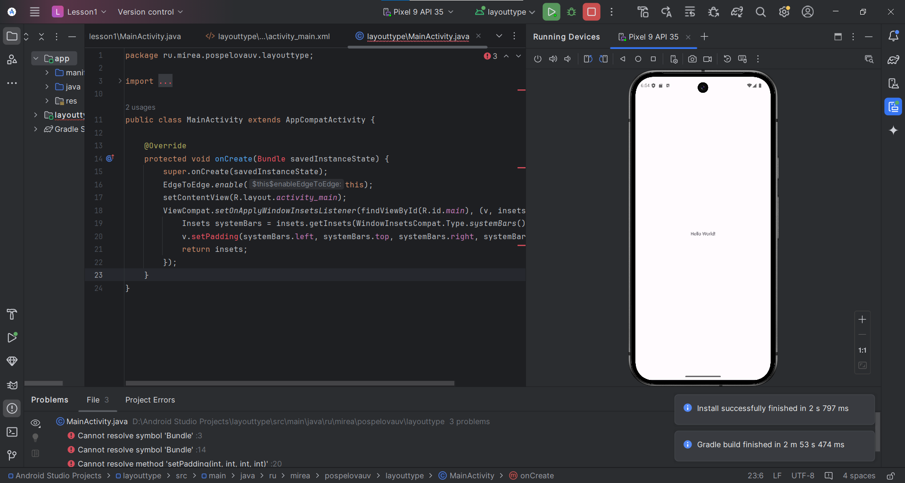

### Создание собственной структуры экрана

На экран был добавлен новый элемент TextView с измененным текстом.

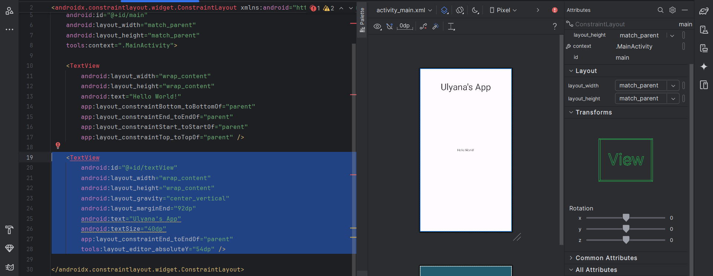 

### Использование контейнеров

Вложим в один «LinearLayout» два других и разместим внутри них элементы «button».

 

Создадим файл разметки «table_layout.xml» с корневым элементом «TableLayout» и добавим в корневой элемент три «TableRow»-строки.

 

Теперь добавим на экран несколько элементов и привяжем их между собой.

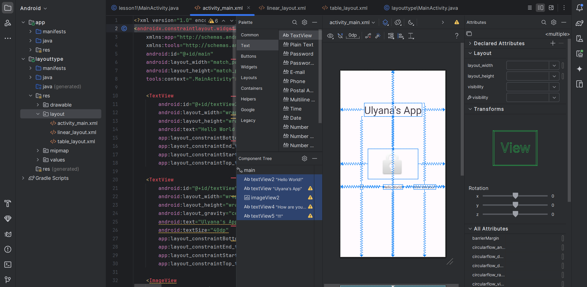 

Создадим собственный экран с использованием изученных элементов в новом модуле. 

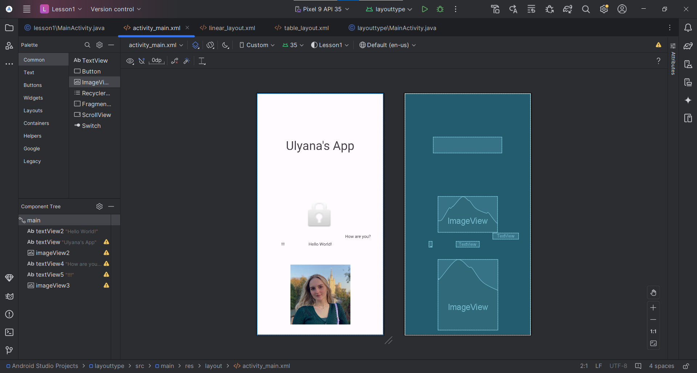 

Создадим layout-файл «activity_second.xml». Далее разработаем экран и для портретной, и для альбомной ориентации.

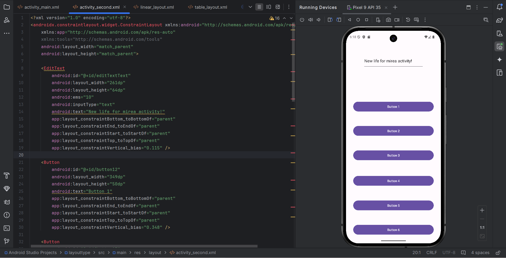 

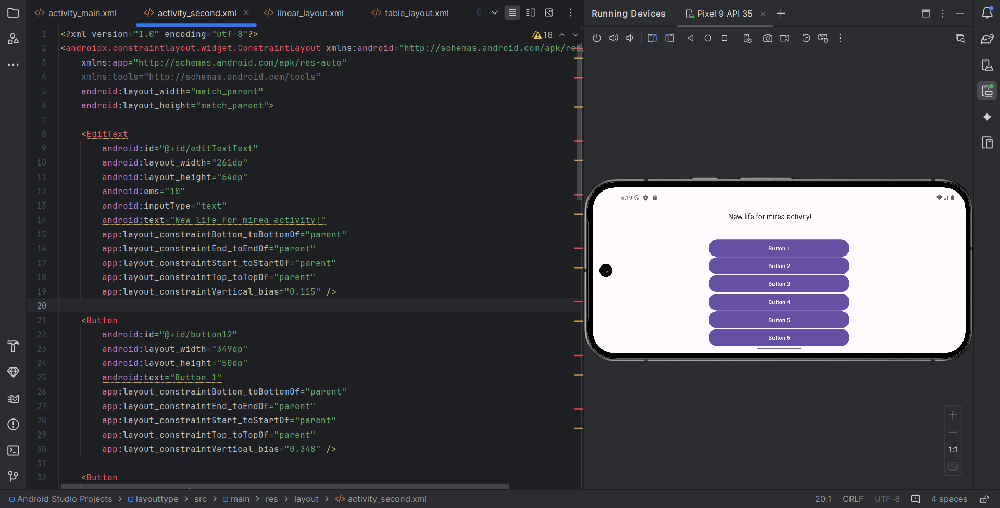 

### Создание обработчиков событий

Обратимся из кода к элементам экрана. Изменим с помощью кода отображаемый на кнопке и в текстовом поле текст.

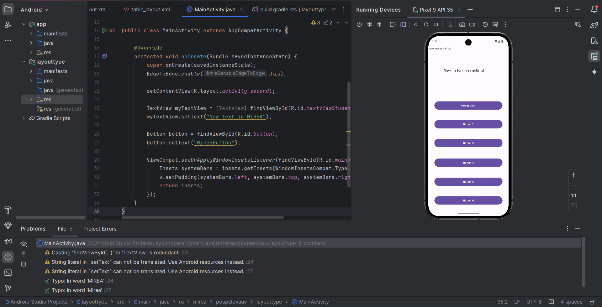 

Создадим новый модуль ButtonClicker, в файле разметки создадим текстовое поле и две кнопки.

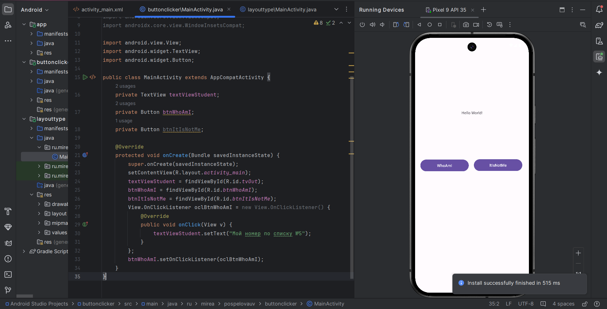 

Создадим обработчик событий для первой кнопки при использованием метода «setOnClickListener (View.OnClickListener l)». После нажатия кнопки надпись в текстовом поле меняется.

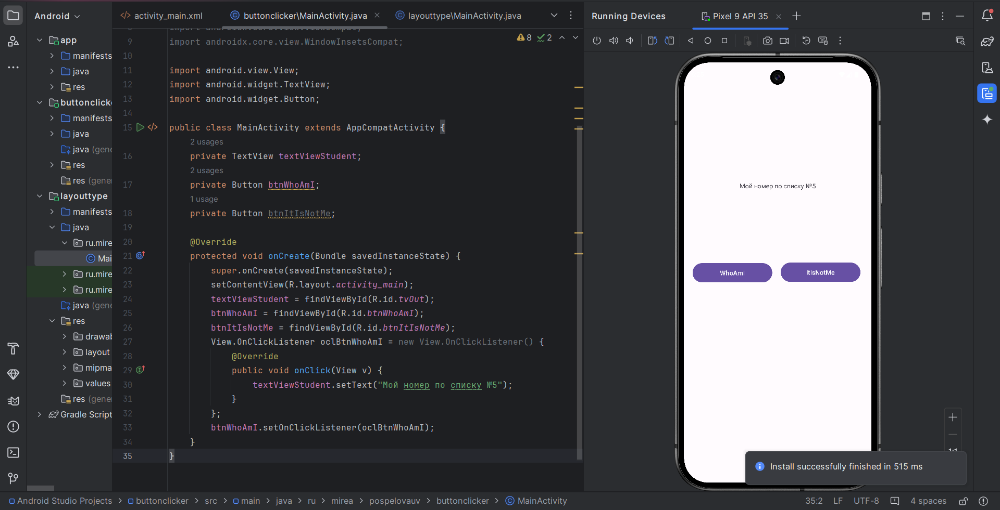 

Теперь добавим на экран CheckBox и создадим обработчик событий для второй кнопки. Для этого воспользуемся атрибутом «onClick» в xml.

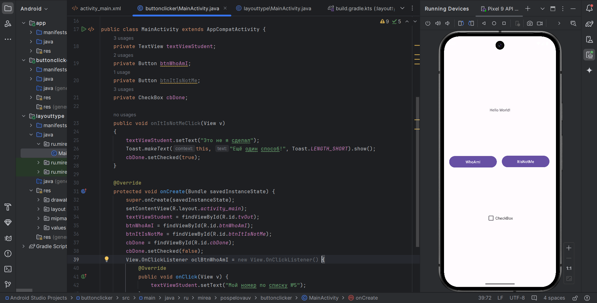 

После нажатия кнопки текстовой поле будет меняться, а чек-бокс примет изменит своё значение. Также всплывёт уведомление о втором способе.

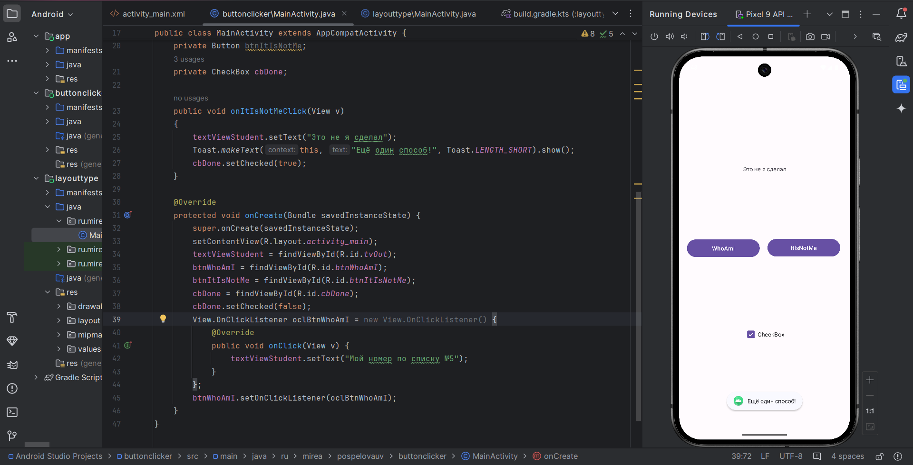 